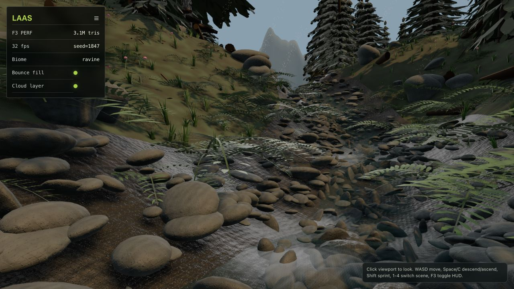

# LAAS

**A code-only WebGPU forest ravine that wants to feel alive before it becomes huge.**

LAAS is a fast vertical slice for a fully procedural browser world. It is not the
entire v2 dream yet. It is the first playable, inspectable proof: a deterministic
ravine scene with procedural terrain, stream water, dense conifers, ferns, storm
wind, a rolling physics ball, water interaction, and lightning that can split
trees and logs.

No scanned assets. No downloaded art pack. No WebGL fallback. The point of this
repo is to see how far a browser can be pushed with TypeScript, Three WebGPU,
Rapier, generated geometry, and a stubborn amount of procedural texture work.



## What You Can Do

- Roll a physics ball through a procedural forest ravine.
- Jump over obstacles, collide with trees, rocks, cobbles, and stream debris.
- Drive the ball into the water and get drag, wakes, ripples, splash, and foam.
- Trigger lightning with `L`; each strike targets a new deterministic conifer.
- Approach the log across the stream and watch an automatic lightning fracture.
- Switch among showcase views with `1-4`.
- Run the same world again with `?seed=1847`.
- Use `?thermal=cool` when the machine gets hot.

## Why It Exists

The original LAAS v2 target is ambitious: a large procedural open world with
erosion, dense vegetation, water, atmosphere, GPU systems, diagnostics, and a
visual bar closer to cinematic mockups than ordinary browser demos.

This repo chooses a faster path:

1. Get a serious scene visible first.
2. Keep systems procedural and deterministic.
3. Record every compromise in `DEVIATIONS.md`.
4. Preserve clean extension points for the full renderer later.

The result is a living prototype rather than a promise slide.

## Current Highlights

### Procedural Ravine

The terrain is generated from deterministic noise, stream carving, erosion-like
relaxation, and smoothed normals. The streambed is dressed with thousands of
cobbles and rocks. Dry ground and wet banks use separate procedural material
logic so the forest floor reads as humus, grit, litter, and damp soil instead of
a single flat green surface.

### Code-Generated Vegetation

Conifers, grass, ferns, flowers, roots, litter, and debris are all generated in
code. Conifers use layered whorl geometry, drooping branch shelves, alpha-cutout
needle texture, and shared trunk/foliage wind deformation so the crown stays
attached while the tree bends in storm wind.

### Moving Water

The stream uses a transparent physical node material, Fresnel color response,
capillary texture detail, raised/feathered edges, procedural surface ripples,
glints, caustic hints, foam around breaker stones, and player-ball disturbance.
It is not a fluid simulation, but it is designed to read as water instead of a
flat ribbon.

### Physics Playground

The rolling ball is backed by Rapier. It has terrain collision, tree blockers,
rock/cobble blockers, jump, third-person camera follow, free-camera toggle, water
drag, wake generation, and splash particles.

### Lightning Fracture

Pressing `L` strikes a new conifer each time. The scene generates bolt branches,
flash light, sparks, smoke, wood chips, charred fracture rims, a rooted stump,
and a falling upper trunk with attached foliage. The log across the stream also
has an automatic cinematic fracture when the ball approaches it.

## Quick Start

### Requirements

- A browser/runtime with WebGPU support.
- Node.js compatible with the installed Vite/TypeScript toolchain.
- Localhost or HTTPS. WebGPU requires a secure context.

### Install

```bash
npm install
```

### Run

```bash
npm run dev
```

Open:

```text
http://127.0.0.1:5173/?seed=1847&scene=ravine&preset=fast
```

Cooler machine mode:

```text
http://127.0.0.1:5173/?seed=1847&scene=ravine&preset=fast&thermal=cool
```

## Controls

Click the viewport to lock pointer.

| Input | Ball mode |
| --- | --- |
| `WASD` | Roll |
| Touchpad / mouse | Look |
| `Space` | Jump |
| `Shift` | Boost |
| `V` | Toggle free camera |
| `L` | Lightning strike |
| `1-4` | Switch scene view |
| `F3` | Toggle HUD |

In free-camera mode, `WASD` moves, `Space/C` ascends/descends, and `Shift`
sprints.

## URL Contract

| Query | Values | Purpose |
| --- | --- | --- |
| `seed` | non-negative integer | Deterministic world generation |
| `scene` | `ravine`, `vista`, `gallery`, `terrain` | Showcase camera mode |
| `preset` | `fast`, `high` | Density and scale preference |
| `thermal` | `normal`, `cool` | Heat/performance mode |

Example:

```text
/?seed=1847&scene=ravine&preset=fast&thermal=normal
```

## Project Shape

```text
src/
  diagnostics/       FPS/frame metrics
  render/app/        WebGPU renderer, camera, loop, input, WebGPU gate
  render/materials/  Procedural terrain, water, bark, foliage materials
  render/objects/    Terrain dressing, water, sky, lightning, player ball
  ui/                DOM HUD and controls hint
  vegetation/        Conifer, fern, grass, wind deformation systems
  world/             Config, seed random, scene views, terrain sampling
scripts/
  smoke-static.mjs   Static contract checks
reference/
  ravine-target.png  Target mood reference
  current-*.png      Current review captures
```

Key docs:

- `DELTA.md` tracks visual changes against the target.
- `DEVIATIONS.md` lists what v2 systems are deferred and why.
- `SMOKE.md` describes the lightweight validation workflow.

## Validation

```bash
npm run typecheck
npm run build
npm run test:smoke
```

Or run the whole local gate:

```bash
npm run validate
```

This project intentionally avoids installing Playwright-managed browsers by
default. Visual checks are meant to happen in the Codex in-app browser or a
user-provided WebGPU browser.

## What This Is Not Yet

LAAS is currently a vertical slice. It deliberately does not claim:

- 4 x 4 km streaming.
- Full GPU erosion.
- True GI probe volume.
- Meshlet/cluster culling.
- Screen-space water refraction/reflection.
- Volumetric cloud raymarching.
- Photogrammetry-grade foliage or terrain.

Those are future phases. The current goal is visible progress, deterministic
systems, and a runnable foundation that can survive aggressive iteration.

## Design Notes

- **WebGPU only:** unsupported environments show a hard diagnostic instead of a
  silent WebGL downgrade.
- **Deterministic by seed:** scene generation should be reproducible through the
  URL contract.
- **Renderer data stays separate from world data:** later GPU culling, streaming,
  and simulation replacements should not require changing scene selection or HUD
  APIs.
- **Procedural first:** geometry, textures, materials, and effects are generated
  in code unless a future phase explicitly introduces an asset pipeline.

## Tech Stack

- Vite
- TypeScript
- Three.js `0.185.1`
- Three WebGPU / TSL node materials
- Rapier `@dimforge/rapier3d-compat`

## Roadmap Ideas

- Better species-specific conifer branching and foliage transmission.
- Real water depth absorption, refraction, shoreline foam, and obstacle wakes.
- More convincing cliff silhouettes and distant mountain erosion.
- Streamed world chunks with stable seed boundaries.
- GPU culling and impostors for much denser vegetation.
- A reference-delta workflow that becomes mandatory once final references exist.

## Status

Prototype, not production. It is meant to be opened, judged visually, pushed
hard, and improved quickly.

Built with Codex using GPT-5.5.
